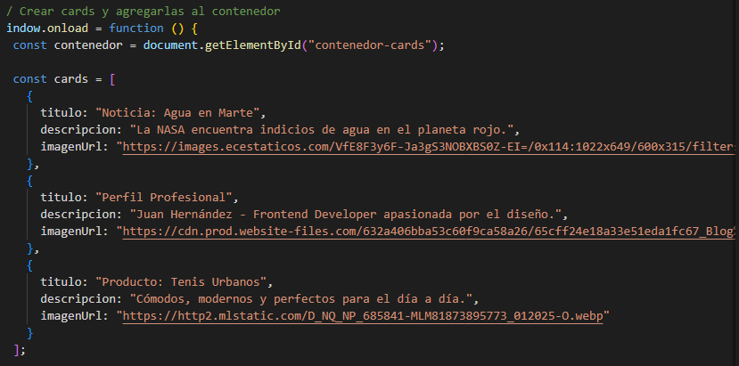
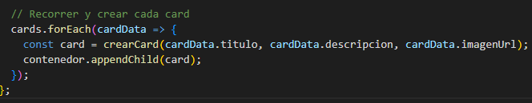

# Componente Visual

## Instituto Tecnológico de Oaxaca

**Estudiantes:**  
- Rodríguez Hernández Alexa Isabel  
- Jiménez Osorio Christopher Martín  

**Equipo 8** 

**Materia:** Programación Web  
**Tarea:** Componente Visual
**Periodo:** Verano 2025  

#### **Descripción ** 
Este componente visual personalizado permite crear y mostrar tarjetas (cards) dinámicamente en una página web utilizando HTML, CSS y JavaScript sin depender de frameworks externos como Bootstrap.

Cada card contiene:

Una imagen destacada.

Un título.

Una descripción.

Un botón de acción ("Ver más").

Gracias a la función crearCard(titulo, descripcion, imagenUrl), el componente automatiza la creación de tarjetas, lo que permite reutilizarlo fácilmente para distintos propósitos, como mostrar:

Productos.

Noticias.

Recetas.

Perfiles de usuario.
#### **Instalación**
Incluirla en un .html con la siguiente nomenclatura 
<link rel="stylesheet" href="componente.css">

##### **Ejemplo de implementación en HTML*
<!DOCTYPE html>
<html lang="es">
<head>
  <meta charset="UTF-8">
  <title>Mi Card Personalizada</title>
  <link rel="stylesheet" href="componente.css">
</head>
<body>

  <h2 style="text-align:center;">Mi Card Hecha a Mano</h2>

  <!-- Aquí se insertarán las cards -->
  

  
</body>
</html>

#### **Capturas de pantalla**
Para agregar cards ve al archivo .js y agrega segun lo desees, con titulo, descripcion y url de tu imagen

Una vez agregado tu card esta parte se encargará de crearla

#### Video 
https://drive.google.com/drive/folders/1AlFHFEs91bzrxFTpVgxhVvLXxSc1wu9u?usp=sharing
